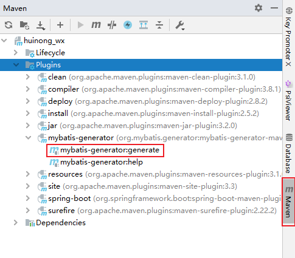

### 1.执行mybatis generator
`generatorConfig.xml`
#### 执行步骤
`点击Maven→→→→→Plugins→→→→→mybatis-generator→→→→→双击mybatis-generator:generate`



### 2.Windown10环境Mysql
`dump文件位置路径\resources\db_dump\huinongwang.db`
#### 2.1 mysql导出dump
```sql
--在系统命令行操作
--C:\Users\30270> mysqldump -uroot -p huinongwang> D:\sql\huinongwang.db
mysqldump -uroot -p huinongwang> D:\sql\huinongwang.db
```
#### 2.2 mysql导入dump
##### 2.2.1 系统行命令
```sql
--在系统命令行操作
--格式：mysql -h[ip] -P[(大写)端口] -u[用户名] -p[密码]  [数据库名] < d:XX.sql(路径) 
--导入命令：mysql -uroot -proot -h127.0.0.1 -P3306 education<d:/database.sql
mysql -uroot -proot -h127.0.0.1 -P3306 huinongwang<D:\sql\huinongwang.db
```
##### 2.2.2 soure 方法
```sql
mysql > use db_name
mysql > source D:\sql\huinongwang.db
```

### 3.git问题
#### 3.1 git push报错
`报错信息如下`
```sql
fatal: unable to access 'https://github.com/Gitcll/huinong_wx.git/': OpenSSL SSL_read: SSL_ERROR_SYSCALL, errno 10054
```
`解决方案`
```sql
--参考网站
--https://zhuanlan.zhihu.com/p/273370216
git config http.sslVerify "false"
```